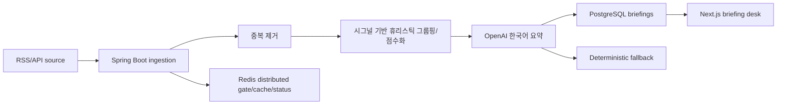

# DevBrief

DevBrief는 AI/개발 뉴스를 개발자 액션까지 정리해주는 한국어 데일리 브리핑 서비스형 풀스택 포트폴리오입니다.

## What I Built

DevBrief는 개발자에게 중요한 AI/개발 뉴스 신호를 골라 액션 가능한 브리핑으로 바꾸는 시스템입니다. RSS, GitHub Trending, 기술 블로그에서 수집한 기사를 URL/content hash로 중복 제거하고, 시그널 기반 휴리스틱 그룹핑과 점수화를 거쳐 한국어 요약, 중요도, 개발자 액션 아이템, 원문 출처를 제공합니다.

Live demo:

- Web: https://web-eight-rho-31.vercel.app
- API: https://devbrief-api-zbbv.onrender.com

단순 기사 목록이 아니라 여러 source에서 같은 신호를 묶고, 다음 정보를 한 화면에서 보여줍니다.

- 무슨 일인지
- 왜 중요한지
- 개발자가 뭘 해보면 좋은지
- 원문 출처와 수집 상태
- 데모 안정성을 위한 fallback 상태

## Stack

- Frontend: Next.js, React, TypeScript, CSS
- Backend: Spring Boot, Spring Data JPA, PostgreSQL, Redis
- Tests: JUnit/MockMvc, Vitest, Testing Library

## Architecture



핵심 운영 흐름은 `RSS/API 수집 -> 중복 제거 -> 시그널 기반 그룹핑 -> 요약 생성 -> Redis 캐시/상태 표시`입니다. `/admin`에서 source별 `정상`, `데모`, `대체 데이터`, `실패` 상태와 가져온 기사 수를 확인할 수 있습니다. Redis가 연결된 환경에서는 수집 job을 distributed gate로 보호하고, Redis가 없거나 장애일 때는 local lock fallback으로 데모가 계속 동작합니다.

## Screenshots


## Project Structure

- `apps/api`: Spring Boot API
- `apps/web`: Next.js UI
- `docker-compose.yml`: local PostgreSQL and Redis
- `render.yaml`: Render API/PostgreSQL/Key Value Blueprint
- `apps/web/vercel.json`: Vercel frontend build config

## API Surface

- `GET /api/briefings/today`
- `GET /api/briefings/{id}`
- `GET /api/trends?range=day|week`
- `GET /api/sources/status`
- `POST /api/admin/ingest/run` (`DEVBRIEF_ADMIN_TOKEN` 설정 시 `X-Admin-Token` 필요)
- `POST /api/admin/briefings/generate` (`DEVBRIEF_ADMIN_TOKEN` 설정 시 `X-Admin-Token` 필요)

## Local Development

Start infrastructure:

```bash
docker compose up -d postgres redis
```

Start the API:

```bash
cd apps/api
mvn spring-boot:run
```

If Docker is not running, use the local H2-backed demo profile:

```bash
cd apps/api
mvn spring-boot:run -Dspring-boot.run.profiles=local
```

Start the web app:

```bash
cd apps/web
npm install
npm run dev
```

API: `http://localhost:8080`

Web: `http://localhost:3000`

The API seeds demo sources, articles, clusters, and briefings by default so the portfolio can be opened immediately. Set `DEVBRIEF_SEED_ON_STARTUP=false` to start empty.

## Deployment

Recommended public demo setup:

- Frontend: Vercel project rooted at `apps/web`
- Backend: Render Blueprint from `render.yaml`
- Database: Render PostgreSQL
- Cache/lock: Render Key Value

Deployment steps:

1. Push this repository to GitHub.
2. Create the Render Blueprint from `render.yaml`.
3. In Render, set `DEVBRIEF_FRONTEND_ORIGIN` to the Vercel URL after the frontend is created.
4. Set `DEVBRIEF_ADMIN_TOKEN` in Render to protect admin mutation endpoints.
5. Optionally set `OPENAI_API_KEY`; if omitted or if the API fails, deterministic Korean demo summaries are used.
6. Create the Vercel project with root directory `apps/web`.
7. Set `NEXT_PUBLIC_API_BASE_URL` in Vercel to the Render API URL.

Deployment URLs:

- Web: https://web-eight-rho-31.vercel.app
- API: https://devbrief-api-zbbv.onrender.com

Current public demo note: the deployed API is running as a free Render Docker web service with H2 memory storage because the Render Blueprint path for managed PostgreSQL/Key Value requires payment info on the workspace. The committed `render.yaml` remains the recommended PostgreSQL/Redis setup for the full portfolio deployment.

## Verification

```bash
cd apps/api && mvn test
cd apps/web && npm test && npm run build
```

## Environment

API defaults:

- `DEVBRIEF_DATABASE_URL=jdbc:postgresql://localhost:5432/devbrief`
- `DEVBRIEF_DATABASE_USER=devbrief`
- `DEVBRIEF_DATABASE_PASSWORD=devbrief`
- `DEVBRIEF_REDIS_HOST=localhost`
- `DEVBRIEF_REDIS_PORT=6379`
- `DEVBRIEF_NETWORK_ENABLED=false`
- `DEVBRIEF_SEED_ON_STARTUP=true`
- `DEVBRIEF_ADMIN_TOKEN=` optional; if set, admin mutation endpoints require `X-Admin-Token`
- `OPENAI_API_KEY=` optional; empty uses deterministic fallback
- `OPENAI_BASE_URL=https://api.openai.com/v1`
- `DEVBRIEF_OPENAI_MODEL=gpt-4o-mini`

Web defaults:

- `NEXT_PUBLIC_API_BASE_URL=http://localhost:8080`

## Portfolio Notes

DevBrief is meant to demonstrate more than CRUD:

- reliable ingestion with source-level success/fallback visibility
- RSS parsing plus GitHub Trending HTML parsing
- duplicate detection through content hashes
- signal-based heuristic grouping, scoring, and Korean briefing generation
- OpenAI provider abstraction with deterministic fallback
- Redis distributed gate/cache status with local lock fallback
- responsive Korean product UI for home, detail, trends, and admin views
