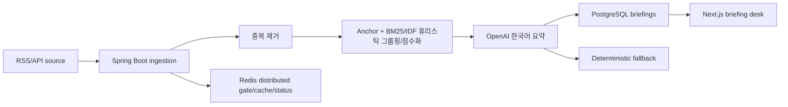
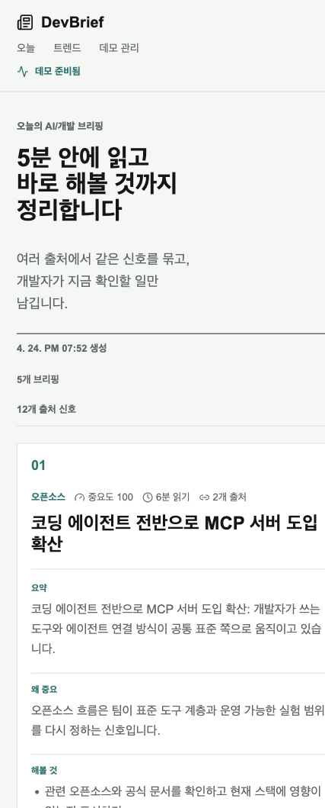
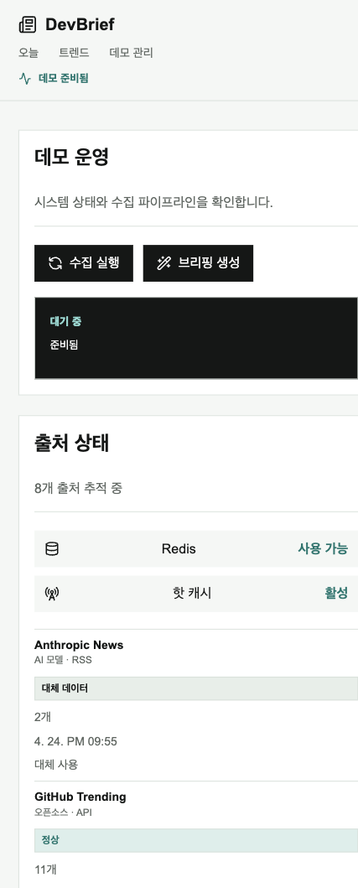

# DevBrief

DevBrief는 AI/개발 뉴스를 개발자 액션까지 정리해주는 한국어 데일리 브리핑 서비스형 풀스택 포트폴리오입니다.

## What I Built

DevBrief는 개발자에게 중요한 AI/개발 뉴스 신호를 골라 액션 가능한 브리핑으로 바꾸는 시스템입니다. RSS, GitHub Trending, 기술 블로그에서 수집한 기사를 URL/content hash로 중복 제거하고, anchor + BM25/IDF 가중 유사도 기반 휴리스틱 그룹핑과 점수화를 거쳐 한국어 요약, 중요도, 개발자 액션 아이템, 원문 출처를 제공합니다.

Live demo:

- Web: https://web-eight-rho-31.vercel.app
- API: https://devbrief-api-zbbv.onrender.com

단순 기사 목록이 아니라 여러 source에서 같은 신호를 묶고, 다음 정보를 한 화면에서 보여줍니다.

- 무슨 일인지
- 왜 중요한지
- 개발자가 뭘 해보면 좋은지
- 원문 출처와 수집 상태
- 데모 안정성을 위한 fallback 상태

## Stack

- Frontend: Next.js, React, TypeScript, CSS
- Backend: Spring Boot, Spring Data JPA, PostgreSQL, Redis
- Tests: JUnit/MockMvc, Vitest, Testing Library

## Architecture



핵심 운영 흐름은 `RSS/API 수집 -> 중복 제거 -> anchor + BM25/IDF 그룹핑 -> 요약 생성 -> Redis 캐시/상태 표시`입니다. `/admin`에서 source별 `정상`, `데모`, `대체 데이터`, `실패` 상태와 가져온 기사 수를 확인할 수 있습니다. Redis가 연결된 환경에서는 수집 job을 distributed gate로 보호하고, Redis가 없거나 장애일 때는 local lock fallback으로 데모가 계속 동작합니다.

## Problem and Design

개발자는 AI 모델, 오픈소스, 보안, 클라우드, 개발 도구 뉴스를 매일 많이 마주치지만, 실제로 필요한 것은 기사 목록이 아니라 “내가 오늘 무엇을 이해하고 무엇을 시험해볼지”입니다. DevBrief는 이 문제를 뉴스 큐레이션이 아니라 수집 파이프라인 문제로 보고 설계했습니다.

- 여러 source를 주기적으로 수집하고 source별 성공, 실패, fallback 상태를 남깁니다.
- URL/content hash로 중복을 줄인 뒤 제목과 excerpt의 anchor 신호, token overlap, BM25/IDF 가중 유사도를 함께 사용해 휴리스틱 그룹핑을 수행합니다.
- 그룹별 점수는 기사 수, 최신성, 개발자에게 의미 있는 키워드를 함께 반영합니다.
- OpenAI 키가 있으면 한국어 브리핑을 생성하고, 없거나 실패하면 기사 제목, source, excerpt를 섞은 deterministic fallback으로 데모가 깨지지 않게 합니다.
- `/admin`은 포트폴리오 설명 페이지가 아니라 실제 운영 화면처럼 수집 실행, 브리핑 생성, source 상태, Redis 상태를 보여줍니다.

## Failure Handling

공개 데모는 외부 RSS, GitHub HTML, OpenAI API, Redis 같은 의존성이 흔들려도 최소한의 사용 경험이 유지되도록 만들었습니다.

- 네트워크가 꺼져 있으면 source status를 `데모`로 표시하고 seed/demo article을 사용합니다.
- 네트워크 요청이나 RSS/GitHub 파싱이 실패하면 `대체 데이터`로 표시하고 실패 메시지를 source별로 남깁니다.
- 원본 응답에서 기사 0개가 나오면 “0개 수집” 메시지와 fallback 여부가 관리자 화면에 보입니다.
- Redis가 있으면 scheduled/manual ingestion을 distributed gate로 보호하고, Redis가 없거나 장애면 local lock으로 중복 실행만 막습니다.
- `DEVBRIEF_ADMIN_TOKEN`이 설정된 환경에서는 수집/생성 mutation endpoint가 `X-Admin-Token` 없이는 실행되지 않습니다.

## What I Learned

- 외부 데이터 수집 프로젝트는 성공 케이스보다 실패 상태를 얼마나 투명하게 보여주는지가 신뢰도를 좌우합니다.
- “AI 클러스터링”처럼 과한 표현보다, 현재 구현 수준을 “anchor + BM25/IDF 기반 휴리스틱 그룹핑/점수화”로 정확히 말하는 편이 면접에서 더 방어 가능합니다.
- fallback은 단순 mock이면 티가 납니다. source 이름, 원문 제목, excerpt 일부를 섞어야 데모 안정성과 브리핑 품질을 함께 챙길 수 있습니다.
- 포트폴리오 UI도 백엔드 구조를 설명하기보다, 사용자가 매일 열어볼 수 있는 제품 흐름이 먼저 보여야 합니다.

## Screenshots





## Portfolio Interview Notes

면접용 1분 설명, 3분 설명, 예상 질문 답변은 [docs/interview-notes.md](docs/interview-notes.md)에 정리했습니다.

## Project Structure

- `apps/api`: Spring Boot API
- `apps/web`: Next.js UI
- `docker-compose.yml`: local PostgreSQL and Redis
- `render.yaml`: Render API/PostgreSQL/Key Value Blueprint
- `apps/web/vercel.json`: Vercel frontend build config

## API Surface

- `GET /api/briefings/today`
- `GET /api/briefings/{id}`
- `GET /api/trends?range=day|week`
- `GET /api/sources/status`
- `POST /api/admin/ingest/run` (`DEVBRIEF_ADMIN_TOKEN` 설정 시 `X-Admin-Token` 필요)
- `POST /api/admin/briefings/generate` (`DEVBRIEF_ADMIN_TOKEN` 설정 시 `X-Admin-Token` 필요)

## Local Development

Start infrastructure:

```bash
docker compose up -d postgres redis
```

Start the API:

```bash
cd apps/api
mvn spring-boot:run
```

If Docker is not running, use the local H2-backed demo profile:

```bash
cd apps/api
mvn spring-boot:run -Dspring-boot.run.profiles=local
```

Start the web app:

```bash
cd apps/web
npm install
npm run dev
```

API: `http://localhost:8080`

Web: `http://localhost:3000`

The API seeds demo sources, articles, clusters, and briefings by default so the portfolio can be opened immediately. Set `DEVBRIEF_SEED_ON_STARTUP=false` to start empty.

## Deployment

Recommended public demo setup:

- Frontend: Vercel project rooted at `apps/web`
- Backend: Render Blueprint from `render.yaml`
- Database: Render PostgreSQL
- Cache/lock: Render Key Value

Deployment steps:

1. Push this repository to GitHub.
2. Create the Render Blueprint from `render.yaml`.
3. In Render, set `DEVBRIEF_FRONTEND_ORIGIN` to the Vercel URL after the frontend is created.
4. Set `DEVBRIEF_ADMIN_TOKEN` in Render to protect admin mutation endpoints.
5. Optionally set `OPENAI_API_KEY`; if omitted or if the API fails, deterministic Korean demo summaries are used.
6. Create the Vercel project with root directory `apps/web`.
7. Set `NEXT_PUBLIC_API_BASE_URL` in Vercel to the Render API URL.

Deployment URLs:

- Web: https://web-eight-rho-31.vercel.app
- API: https://devbrief-api-zbbv.onrender.com

Current public demo note: the deployed API is intentionally kept on a free Render Docker web service with H2 memory storage. Admin mutation endpoints are designed to be token-protected with `DEVBRIEF_ADMIN_TOKEN`; the committed `render.yaml` remains the recommended PostgreSQL/Redis setup for a fuller paid portfolio deployment.

## Verification

```bash
cd apps/api && mvn test
cd apps/web && npm test && npm run build
```

## Environment

API defaults:

- `DEVBRIEF_DATABASE_URL=jdbc:postgresql://localhost:5432/devbrief`
- `DEVBRIEF_DATABASE_USER=devbrief`
- `DEVBRIEF_DATABASE_PASSWORD=devbrief`
- `DEVBRIEF_REDIS_HOST=localhost`
- `DEVBRIEF_REDIS_PORT=6379`
- `DEVBRIEF_NETWORK_ENABLED=false`
- `DEVBRIEF_HTTP_CONNECT_TIMEOUT=3s`
- `DEVBRIEF_HTTP_READ_TIMEOUT=8s`
- `DEVBRIEF_SCHEDULER_ENABLED=true`
- `DEVBRIEF_SCHEDULER_CRON=0 0 8,18 * * *`
- `DEVBRIEF_SCHEDULER_ZONE=Asia/Seoul`
- `DEVBRIEF_SEED_ON_STARTUP=true`
- `DEVBRIEF_ADMIN_TOKEN=` optional; if set, admin mutation endpoints require `X-Admin-Token`
- `OPENAI_API_KEY=` optional; empty uses deterministic fallback
- `OPENAI_BASE_URL=https://api.openai.com/v1`
- `DEVBRIEF_OPENAI_MODEL=gpt-4o-mini`

Web defaults:

- `NEXT_PUBLIC_API_BASE_URL=http://localhost:8080`

## Portfolio Notes

DevBrief is meant to demonstrate more than CRUD:

- reliable ingestion with source-level success/fallback visibility
- RSS parsing plus GitHub Trending HTML parsing
- duplicate detection through content hashes
- anchor + BM25/IDF heuristic grouping, scoring, and Korean briefing generation
- OpenAI provider abstraction with deterministic fallback
- Redis distributed gate/cache status with local lock fallback
- responsive Korean product UI for home, detail, trends, and admin views
